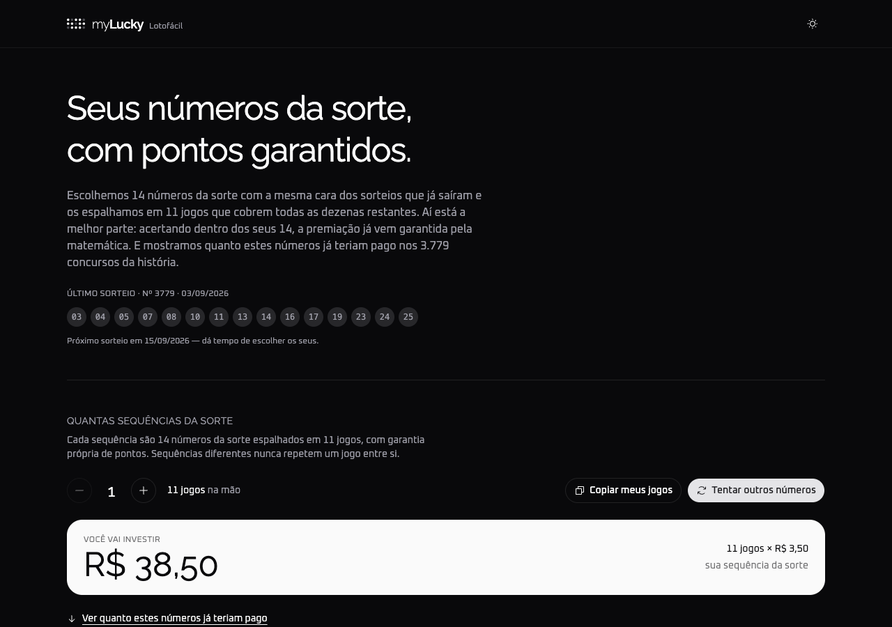
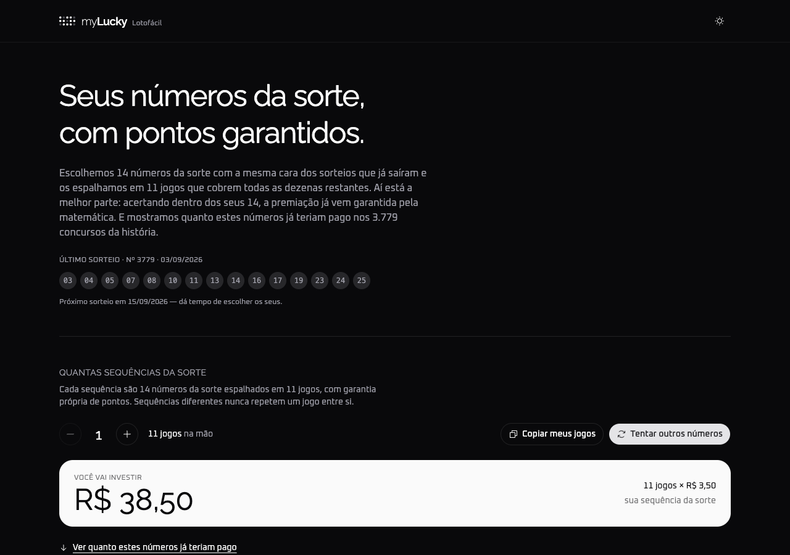

# myLucky

Gerador de desdobramentos para a Lotofácil. Sorteia 14 dezenas e as espalha em 11 jogos que cobrem
todas as dezenas restantes — o que torna a premiação **determinística** em função de quantas dezenas
você acerta dentro das 14.

**Live →** [mylucky-lotofacil.vercel.app](https://mylucky-lotofacil.vercel.app)



---

## O que faz

- **Desdobra 14 dezenas em 11 jogos** com garantia de pontos que não depende de sorte
- **Confere contra todos os 3.779 concursos** já realizados, do nº 1 (29/09/2003) em diante
- **Mostra quanto teriam pago**, usando os prêmios fixos oficiais da Caixa
- **Marca o que você já apostou**, para conferir no computador enquanto joga pelo celular
- **Atualiza o histórico sozinho**, direto da API da Caixa



---

## A garantia

Não é probabilidade, é combinatória. Cada um dos 11 jogos repete as 14 dezenas fixas e adiciona uma
das 11 dezenas de fora, cobrindo todas elas. O resultado é fechado:

| Acertos nas 14 fixas | Garantido | E ainda |
| --- | --- | --- |
| 14 | 1 jogo de **15 pontos** | 10 de 14 pontos |
| 13 | 2 jogos de 14 pontos | 9 de 13 pontos |
| 12 | 3 jogos de 13 pontos | 8 de 12 pontos |
| 11 | 4 jogos de **12 pontos** | 7 de 11 pontos |
| 10 | 5 jogos de 11 pontos | 6 de 10 pontos |

Isso é verificado por teste automatizado: 40 conjuntos × 3.779 sorteios = **151.160 comparações**
entre a tabela teórica e a contagem real, jogo a jogo.

---

## Honestidade estatística

Filtros estatísticos **não** aumentam a chance de acerto. As faixas históricas (pares, soma, primos,
moldura, repetidos) foram testadas contra 200 mil combinações aleatórias em 8 níveis de aperto:

| Aperto | Sorteios reais aprovados | Aleatórias aprovadas | Ganho |
| --- | --- | --- | --- |
| 99% | 96,2% | 96,0% | **1,00×** |
| 95% | 74,9% | 74,2% | **1,01×** |
| 80% | 35,9% | 35,9% | **1,00×** |
| 60% | 5,4% | 5,1% | **1,06×** |

O motivo é estrutural: a Lotofácil é um sorteio uniforme, então os resultados reais têm exatamente o
mesmo perfil estatístico de qualquer combinação. Os filtros servem para dar aos números gerados o
perfil dos sorteios que de fato aconteceram — não para prever o próximo.

A aposta de 15 dezenas custa **R$ 3,50** ([tabela oficial][precos]), então cada sequência de 11 jogos
custa **R$ 38,50** e devolve, em média, **R$ 16,36** por concurso — retorno de **−57,5%**. A conta é
exata: a distribuição de acertos é hipergeométrica, com `P(k≥11) = 4,16%` e `P(k≥10) = 18,31%`,
valores que batem com a frequência medida nos 3.779 concursos reais. Essa é a margem da loteria e
nenhum sistema a contorna.

[precos]: https://loterias.caixa.gov.br/paginas/lotofacil.aspx

---

## Stack

| Camada | Escolha |
| --- | --- |
| Build | Vite 8 + TypeScript 6 |
| UI | React 19 + Tailwind v4 + shadcn/ui (zinc, base-ui) |
| Tabela | TanStack Table v8 |
| Rotas | React Router v7 |
| Animação | Lottie (chunk sob demanda) + canvas |
| Fontes | Raleway (títulos, `--font-heading`) + Oxanium (texto, `--font-sans`) |
| Lint/Format | Biome |
| Testes | Vitest |
| Deploy | Vercel + GitHub Actions |

---

## Arquitetura

- **Núcleo matemático puro** — `src/utils/` não conhece React: `stats` deriva as faixas do histórico,
  `generator` sorteia o pool, `wheel` monta o desdobramento e `backtest` confere contra a série
- **Atomic design** — `elements` → `widgets` → `modules` → `templates` → `pages`, um diretório por
  componente com `index.tsx`
- **Faixas derivadas dos dados** — as bandas de cada métrica saem de todos os subconjuntos de 14 dos
  sorteios vencedores (56.685 amostras), não de constantes escolhidas à mão
- **Estado em `localStorage`** — a sequência sorteada e os jogos marcados sobrevivem ao reload
- **Carregamento sob demanda** — o player Lottie entra por `import()` dinâmico, então vira um chunk
  separado baixado apenas no primeiro sorteio

---

## Identidade visual

A marca é um lockup de símbolo + wordmark, sem nenhuma dependência ou token de cor novo — tudo sai do
que `src/index.css` já define.

**O símbolo** é a própria cartela: uma grade 5×3 de círculos em `viewBox="0 0 60 34"` (raio 4, passo
13, primeiro centro em 4,4). Dez pontos cheios representam as 14 dezenas fixas e cinco pontos claros
as 11 de fora — a mesma ideia de cobertura que o app executa. Os cheios usam `currentColor`, então
herdam `text-foreground` e funcionam em light e dark sem regra extra; os claros usam
`fill-muted-foreground/45`.

**O wordmark** repete esse contraste na tipografia: `my` em Raleway 200 (`font-extralight`) e `Lucky`
em Raleway 600 (`font-semibold`), a 18px com `tracking-tight`. O descritor "Lotofácil" some abaixo do
breakpoint `sm`.

**O favicon** é o recorte 3×3 central da cartela sobre placa `oklch(0.141 0.005 285.823)`:

| Arquivo | Uso |
| --- | --- |
| `public/favicon.svg` | principal, círculos em viewBox 64 (raio de placa 12) |
| `public/favicon-16.svg` | 16px, com os círculos virando quadrados de 2px para sobreviver ao hinting |
| `public/apple-touch-icon.png` | 180px, para iOS |

O componente vive em [`src/components/elements/Logomark/index.tsx`](src/components/elements/Logomark/index.tsx)
e é stateless.

---

## Rodando localmente

```bash
npm install
npm run dev
```

| Script | O que faz |
| --- | --- |
| `npm run dev` | sobe o servidor de desenvolvimento |
| `npm run build` | typecheck + build de produção |
| `npm test` | testes do núcleo matemático |
| `npm run typecheck` | checagem de tipos do app e dos testes |
| `npm run check` | formata e corrige com Biome |
| `npm run history:update` | busca os concursos novos na API da Caixa |

---

## Histórico

`public/data/history.json` guarda todos os concursos desde o nº 1 (29/09/2003), e a atualização tem
duas camadas:

1. **Ao vivo, no navegador.** A API oficial da Caixa responde com CORS liberado, então o app consulta
   o último concurso a cada carregamento. Se houver sorteio novo, ele é anexado na hora (até 12
   concursos de atraso) e a página marca "atualizado agora". Se a API estiver fora, falha em silêncio
   e o app segue com o JSON.
2. **Diária, no repositório.** Uma GitHub Action roda `npm run history:update` às 03:00 UTC, commita
   o JSON e o push redeploya — mantendo o arquivo-base em dia.

Os sorteios saem por volta das 20h (BRT), de segunda a sábado.

---

## Créditos

O efeito de borda animada é adaptado do [ElectricBorder](https://reactbits.dev) do React Bits —
Copyright (c) 2026 David Haz, sob MIT + Commons Clause License Condition v1.0. Foi modificado para
usar exportação nomeada, herdar a cor do tema, animar apenas o cartão sob o cursor e respeitar
`prefers-reduced-motion`.
